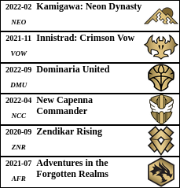
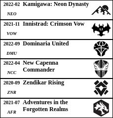

# MagicTGTools

Welcome on MagicTGTools!

You will find here some (hopefuly) useful tools for Magic The Gathering:

- [**Label Generator**](mtg-labels/)

    Generate and print labels to organize your ever growing collection.
 
    <table>
        <thead>
          <tr>
            <td rowspan="2"></td>
            <td></td>
          </tr>
          <tr>
            <td></td>
          </tr>
        </thead>
    </table>
    

- [**Deck URL Generator**](deck-url-generator/)

    Generate links directly to cards from the text deck list.

    (Available just for some Czech shops only)
