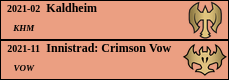
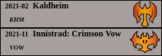

# Magic The Gathering - Cards Label generator

<!-- [](https://hub.docker.com/r/valgrut/mtg-labels) -->

[](https://hub.docker.com/r/valgrut/mtg-labels)  [](https://mtglabels.wogon.cz)

## 1. Description


## Available Label Examples:

|  Small Label (Default) - Common | Small Label (Default) - Uncommon  |  Small Label (Default) - Mountain + Rare  |
:-------------------------:|:-------------------------:|:-------------------------:
  |   | 

|  Small Label (No-date) - Common | Small Label (No-date) - Forest + Uncommon  |  Small Label (No-date) - Swamp + Mythic |
:-------------------------:|:-------------------------:|:-------------------------:
  |   | 

|  Large Label (Default) - Common |  Large Label (Switched) - Rare  | Large Label (Switched) - Mythic |
:-------------------------:|:-------------------------:|:------------------------------------:
  |   | 

## 2. How to use it

Example input: DMU,NCC,NEO,VOC,VOW,TSR,RNA

### 2.1 Just pull and run the container from hub.docker.com (simplest)
```
(sudo) docker run -it --rm valgrut/mtg-labels
```

Link: https://hub.docker.com/r/valgrut/mtg-labels

### 2.2 Online on my server
This website will be online on [**mtglabels.wogon.cz**](https://mtglabels.wogon.cz) webpage.

### 2.3 Run app Locally
Clone this repository and run server *locally*:
```
    export FLASK_ENV=development
    export FLASK_APP=app
    flask run
```

and now open **http://localhost:5000** in your browser.

### 2.4 In self-built Container
Build the image:
```
docker build --tag valgrut/mtg-labels .
```

and run the app in the container:
```
docker run -d -p 5000:5000 valgrut/mtg-labels
```

Finally cleanup the mess:
```
docker ps
docker stop valgrut/mtg-labels
docker container prune
```


If this tool has been useful for you, leave a ⭐ star ⭐ please and come back again for new labels!


## 3. Create your own template
### 3.1 Using prepared bash script

1. You can use this bash script to create template, style and add ref to the code.
```
./create-new-label-template.sh new-template-name
```

2. Now just edit generated template and stylesheet and enjoy new label!

3. Optional: Create a merge request to extend the template pool for others!


### 3.2 [Not recommended] Manually
<details><summary><b>Show manual steps to add new Template</b></summary>
<p>
<pre>
Important note 1: Keep an eye on the naming of the files and of the added lines in the code!
- 'label\_type' in app.py must match the html form '\<option value='
- 'label\_type\_name' in app.py must match template and stylesheet file names

1. Copy and modify your copy of the template file in templates/
```bash
cp templates/small-labels-default-template.html templates/NEW-LABEL-OPTION-STYLE-NAME-template.html
vim templates/NEW-LABEL-OPTION-STYLE-NAME-template.html
```

2. Copy and modify your copy of the stylesheet file in static/
```bash
cp static/small-labels-default.css static/NEW-LABEL-OPTION-STYLE-NAME.css
vim static/NEW-LABEL-OPTION-STYLE-NAME.css
```

3. Add option into the html form in the 'index.html' file
```html
<option value="NEW_LABEL_OPTION_STYLE">New label style name</option>
```

4. Add 'elif' lines into the 'app.py'
```python
elif label_type == "NEW_LABEL_OPTION_STYLE_NAME":
    label_type_name = "NEW-LABEL-OPTION-STYLE-NAME"
```

Which is passed into the files path later in the code.
```
    html_label_template = label_type_name+"-template.html"
    css_label_style = "static/"+label_type_name+".css
```
</pre>
</p>
</details>


## 4. Useful stuff:
- [Amazon.com - Plastic Card Dividers](https://www.amazon.com/Plastic-Dividers-Baseball-Trading-Divider/dp/B09H2XSCFT/ref=sr_1_11?crid=3PQKODNJAT4SL&keywords=BCW%2BTall%2BTrading%2BCard%2BDividers%2B-%2B50%2Bct&qid=1663061447&sprefix=bcw%2Btall%2Btrading%2Bcard%2Bdividers%2B-%2B50%2Bct%2B%2Caps%2C290&sr=8-11&th=1)
- [Sticker Printer Paper](https://www.amazon.com/dp/B06XZS3L5F/)
- [Card House Storage Box for 12x800 cards](https://www.amazon.com/Card-House-Storage-Box-800-Count/dp/B01M3YVUDR/ref=sr_1_14?crid=3PQKODNJAT4SL&keywords=BCW+Tall+Trading+Card+Dividers+-+50+ct&qid=1663061447&sprefix=bcw+tall+trading+card+dividers+-+50+ct+%2Caps%2C290&sr=8-14)


## 5. Tool Development - Convert excell table to csv file
- Convert excell ods file into csv for future processing
```
soffice --convert-to csv --outdir /tmp/ sets-list.ods
libreoffice --convert-to csv --outdir /tmp/ sets-list.ods
```

- Push updated docker image into dockerhub
```
docker login
docker push valgrut/mtg-labels
```

- README.md live preview
```
pipx run grip
```

There is limit 60 requests/hour. This will be solved with [offline renderer](https://github.com/joeyespo/grip/issues/35) someday.
